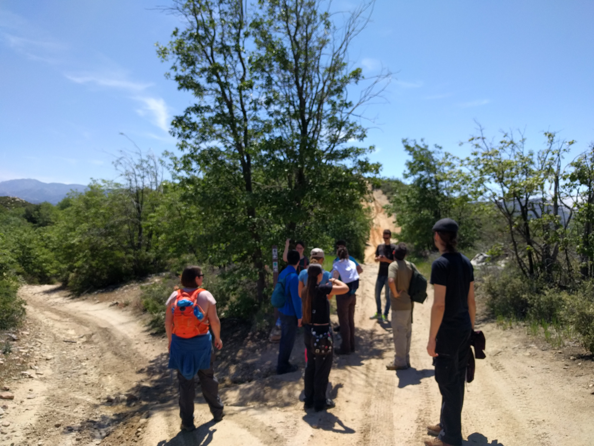

# PAPR 2018 is over!

The retreat is now over! Thanks everyone for coming and participating! We hope you found it useful, and that you now know all your colleagues working within 5 miles of you!

You will find below all the information we used to organize the retreat, and most importantly, links to our invited speakers presentations, to the projects slides, and our social medias.

## What's next? 
After 3 days of bonding over science, murder hunting, and beach volley, is it already all over? **Not at all!** Keeping our community strong and livy is fundamental, in our opinion. If you think so too, here are several other opportunities to cross the boundaries between our institutes:
- **Postdoc Mixers!** Every now and then, hosted each time in one of our institute, a great opportunity to get together again regularly. Next one is June t, 5-7pm at IPAC, rooftop of Keith Spalding building!
- **Astro on Tap!** Every first Monday of the month, at Der Wolfskopt Pub, to give 10-15mn public talks and support our fellow postdocs! Next one is [June 4th](http://www.astro.caltech.edu/outreach/), 7:30-9:30pm! 
- **PAPR 2019!** If you enjoyed this year's retreat, and are looking forward to next year's edition, it's not going to happen by itself! Several of your servant SOC members will be gone and the retreat need fresh volunteers to be as awesome as ever! We are counting on **you**! 

# PAPR 2018 Program and useful links

<a href="PAPR2018_schedule(7).pdf">The final Program</a>, after many live edits during the retreat :)

## Social media

- Linkedin
- [Facebook page](https://www.facebook.com/events/1680920865305936/)
- Twitter

## Invited Talks on career development

Our invited speakers gave exciting 1h-talk about possible career path and developments that postdocs in astronomy are usually facing. **See below links to their Speakers' presentations!**

- Tiffany Kataria - Scientist at Jet Propulsion Laboratory - Scientist in Research Center
- Farisa Morales - Professor at California State University, Northridge - Research and Teaching
- Jake Hartman - Software Engineer at Google - Astro to Industry

## Projects on carrer development

- Overcoming inconscious bias in astronomy
- Alternative/Active teaching methods
- Software engineer Job interviews

## Introduction Talks 

All postdocs gave a 1-minute presentations to introduce themselves and present their research. **See below the links to the Postdocs' introduction slides and bio!**

<a href="PAPR_Bios.pdf">Participant Bios</a>

## Pre-retreat hike

Similar to last year, we had an optional pre-retreat hike in the morning before the retreat. The [Sawmill Road Loop Trail](https://www.alltrails.com/explore/trail/us/california/sawmill-road-loop-trail) is only 3 miles long, features wonderful views, and is just a 5-minute drive from the conference center. 

# What is the Pasadena Astronomy Postdoc Retreat?

The purpose of this annual informal meeting is to bring together postdocs from the various astrononomy institutes in Pasadena (Carnegie, Caltech Astro/GPS, IPAC, and JPL), and to get to know each other's science. Building on previous years' experience, the retreat is an opportunity to cross institutional boundaries, foster new collaborations, and enrich the experience of being an astronomy postdoc in the City of Astronomy.

This year's retreat was held on May 9-11th 2018. The program included a mix of brief research talks by attendees, 3 career development talks by our invited speakers, and several social gatherings. 

# Registration

The registration fee is $525 per person.
Carnegie funded 100% of the cost of the retreat for its postdocs. 
Caltech astronomy funded 50% of the cost of the retreat for its postdocs. The rest of the funding have to come from the postdoc's travel funds.
For the other institutions, there was unfortunately no funding available for this year's retreat, and thus 100% had to come from the personal travel fund.

## Registered Participants

<a href="PAPR_Bios.pdf">Participant Bios</a>

- Shahab Arabshahi
- Elodie Choquet
- Thomas Connor
- Riley Connors
- Trevor David
- Iary Davidzon
- Maria Drout
- Hannah Earnshaw
- Andreas Faisst
- Virginie Faramaz
- Decker French
- Shea Garrison-Kimmel
- Rohini Giles
- Marianne Heida
- Nina Hernitschek
- Cameron Hummels
- Albert Izard
- Sebastian Kiehlmann
- Kirsten Larson
- Eve Lee
- Daniel Lenz
- Jacqueline McCleary
- Rosalie McGurk
- Anne Medling
- Alex Merson
- Max Millar-Blanchaer
- Sean Mills
- Daniel Paardekooper
- Gina Panopoulou
- Stefano Pasetto
- Abhishek Prakash
- Vikram Ravi
- Arpita Roy
- Garreth Ruane
- Allison Strom
- Johanna Teske
- Harish Vedantham
- Coral Wheeler
- Marie Ygouf

# Organizing Committee

- Elodie Choquet (JPL/Caltech)
- Daniel Lenz (JPL/Caltech)
- Alex Merson (JPL/IPAC)
- Stefano Pasetto (Carnegie)
- Harish Vedantham (Caltech)
- Marie Ygouf (IPAC/Caltech)

# The Venue

## Transportation / carpools

The retreat is held at the  [UCLA Lake Arrowhead Conference Center](http://lakearrowheadconferencecenter.ucla.edu/about/directions/), which is a convenient [2 hour](https://www.google.com/maps/dir/Pasadena,+California/UCLA+Lake+Arrowhead+Conference+Center,+850+Willow+Creek+Rd,+Lake+Arrowhead,+CA+92352/@34.1971218,-117.9448351,10z/data=!3m1!4b1!4m18!4m17!1m5!1m1!1s0x80c2c2dc38330b51:0x52b41161ad18f4a!2m2!1d-118.1445155!2d34.1477849!1m5!1m1!1s0x80c357e80a92254b:0xdc8a5a45759372b0!2m2!1d-117.1866611!2d34.2655173!2m3!6e0!7e2!8j1525865100!3e0) drive from Pasadena. 

Like previous years, we organized a carpooling system to help everybody go to the venue.
[Carpooling Spreadsheet here.](https://docs.google.com/spreadsheets/d/1d5grzYo76jLK4t76VM5wbl9XyPsMx03dwn5YkGQGnqk/edit?usp=drive_web&ouid=106650781263756717976)

## Activities
The Conference Center has plenty of outdoor activities: 
Swimming pool, Hot tub, Tenis Court, Sand Volleyball Court, Zen deck, Climbing wall...
Don't forget to bring your sportwear if you want to enjoy these activities!

## Accommodations and meals

The UCLA conference center fully [accommodates](http://lakearrowheadconferencecenter.ucla.edu/accommodations/) and [cater](http://lakearrowheadconferencecenter.ucla.edu/dining/) for us. The 'condolets' at the conference center accommodate two people, and offer a queen size bed with bath downstairs and a second queen size bed with bath upstairs. A living room area with wood-burning fireplace is shared by two conferees. All condolets have large decks with potential lake or forest views.

Attendees share their room with another attendee. 
We used this [Spreadsheet](https://docs.google.com/spreadsheets/d/1d5grzYo76jLK4t76VM5wbl9XyPsMx03dwn5YkGQGnqk/edit?usp=drive_web&ouid=106650781263756717976) to organize roommate preferences.
Otherwise roommates were assigned on a same-gender basis.

The conference center caters for all meals, which are covered in the cost of the retreat. They accommodate all dietary requirements detailed during registration. Dietary restrictions were listed [here](https://docs.google.com/spreadsheets/d/1d5grzYo76jLK4t76VM5wbl9XyPsMx03dwn5YkGQGnqk/edit?usp=sharing).
